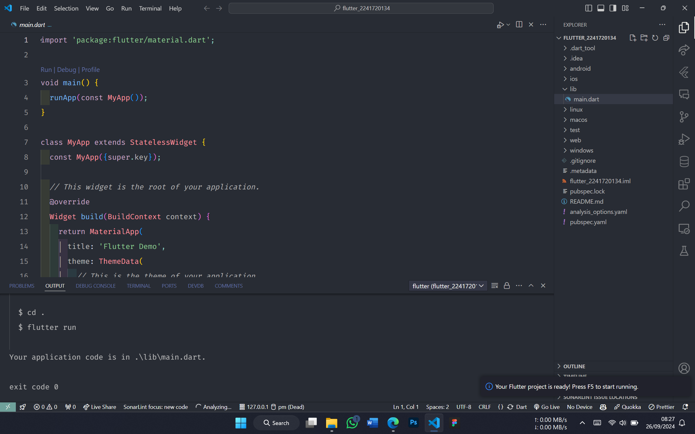

# Week 5 Aplikasi Pertama dan Widget Dasar Flutter

**Nama** : Byan Nur Cahyo

**NIM** : 2241720134

**Kelas** : TI-3D

---
## Tugas Praktikum

### Soal 1.

-   ### Praktikum 1

    -   Langkah 1
        

    -   Langkah 2
        
    
    -   Langkah 3
        

    -   Langkah 4
        

-   ### Praktikum 2

    -   Langkah 1
        

    -   Langkah 2
        
    
    -   Langkah 3
        

    -   Langkah 4
        

    -   Langkah 5
        

    -   Langkah 6
        
    
    -   Langkah 7
        

    -   Langkah 8
        
        
    -   Langkah 9
        

-   ### Praktikum 3

    -   Langkah 1
        

    -   Langkah 2
        

-   ### Praktikum 4

    -   Langkah 3
        

    -   Langkah 4
        

    -   Langkah 5
        

    -   Langkah 6
        

### Soal 2.

### Soal 3.

### Soal 4.
