# Week 6 Layout dan Navigasi

**Nama** : Byan Nur Cahyo

**NIM** : 2241720134

**Kelas** : TI-3D

---

## Tugas Praktikum 1

### Soal 1.

-   ### Praktikum 1

    -   Langkah 1
        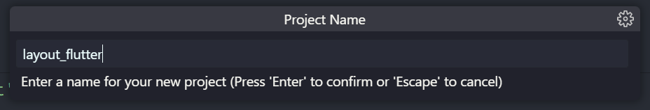

    -   Langkah 2
        

    -   Langkah 4
        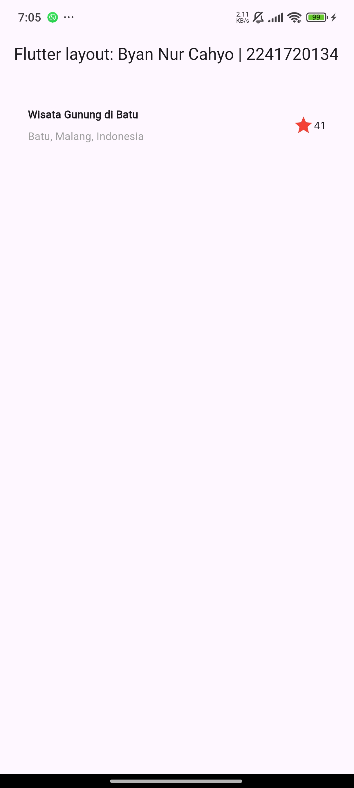

-   ### Praktikum 2

    -   Langkah 1
        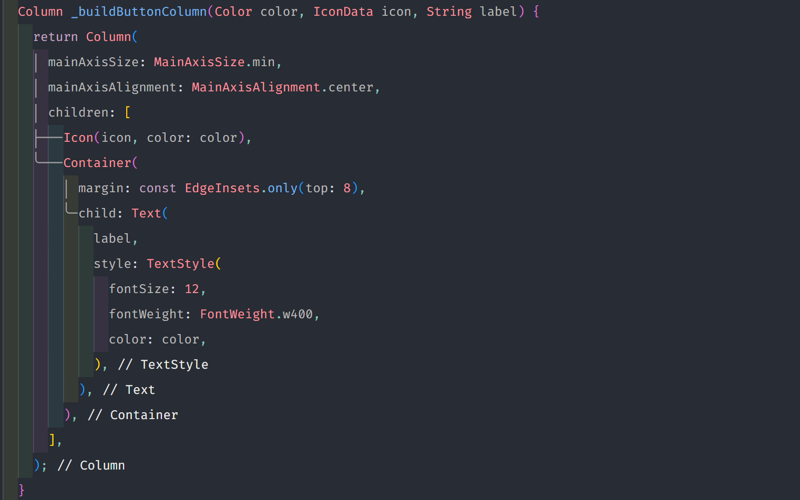

    -   Langkah 2
        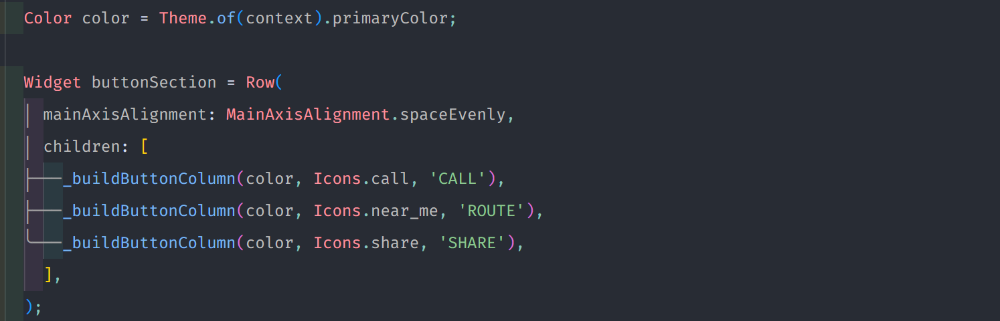

    -   Langkah 3
        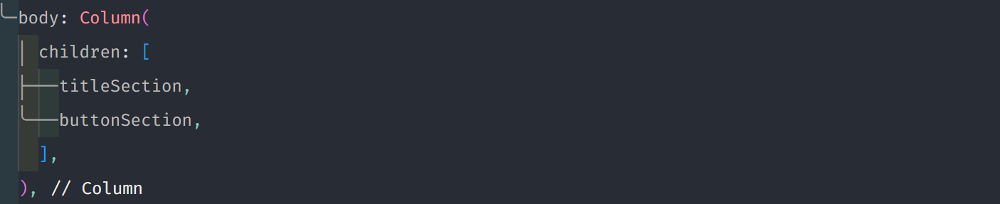

    

-   ### Praktikum 3

    -   Langkah 1
        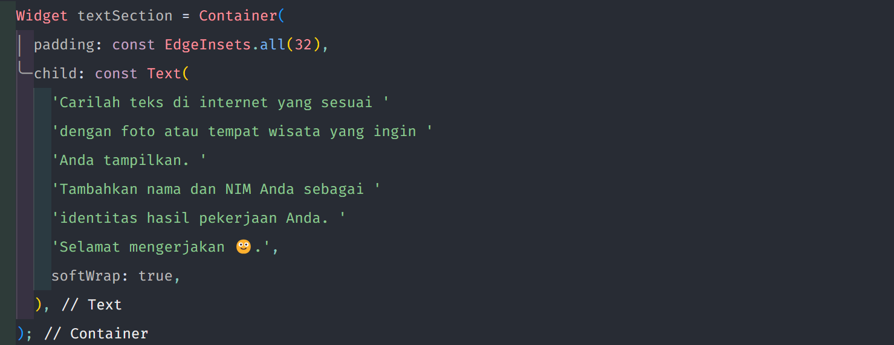

    -   Langkah 2
        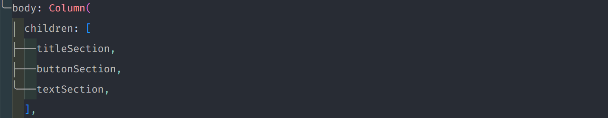

    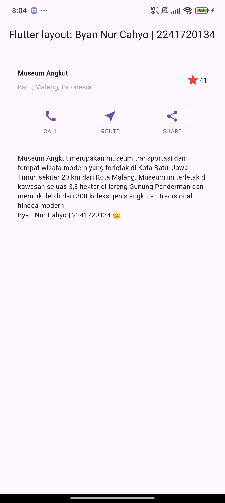

-   ### Praktikum 4

    -   Langkah 1
        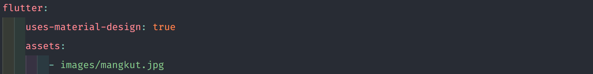

    -   Langkah 2
        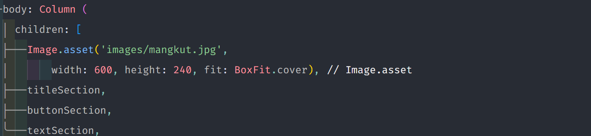

    -   Langkah 3
        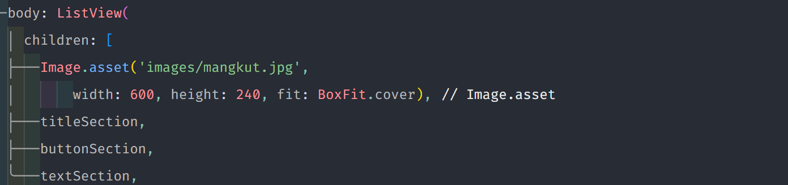

    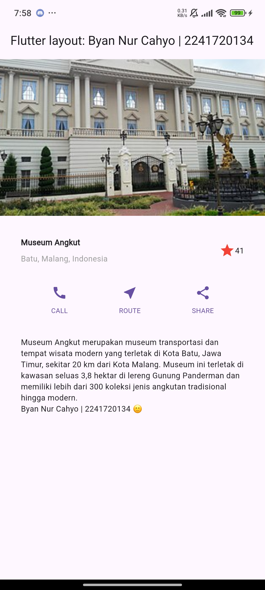

### Soal 2.

-   ### Praktikum 5

    -   Langkah 1
        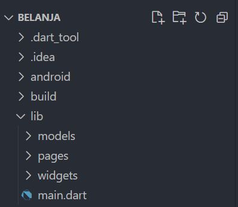

    -   Langkah 2
        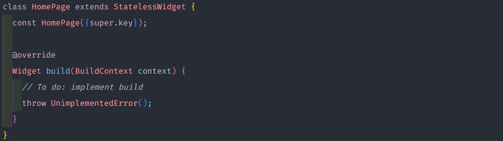
        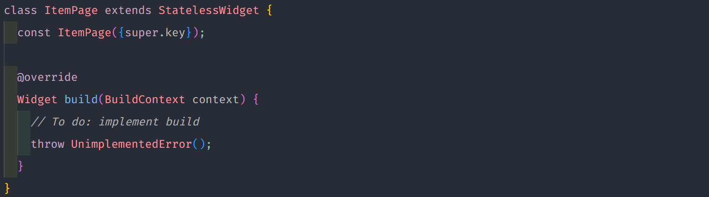

    -   Langkah 3
        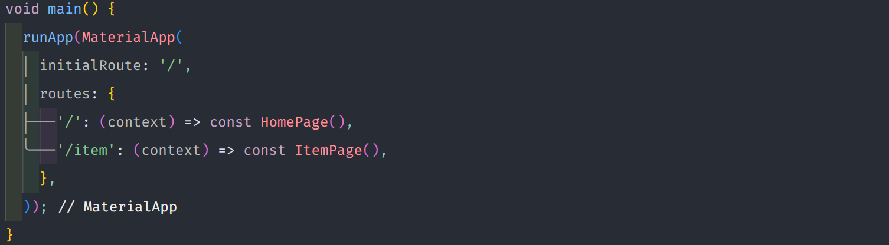

    -   Langkah 4
        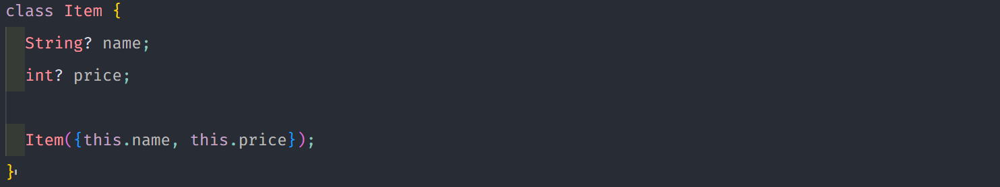

    -   Langkah 5
        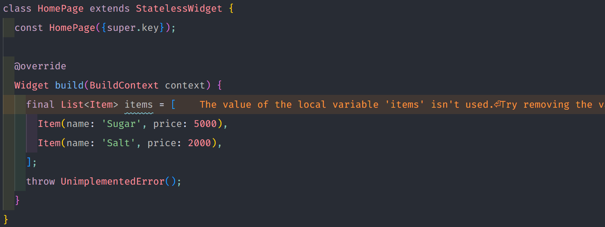

    -   Langkah 6
        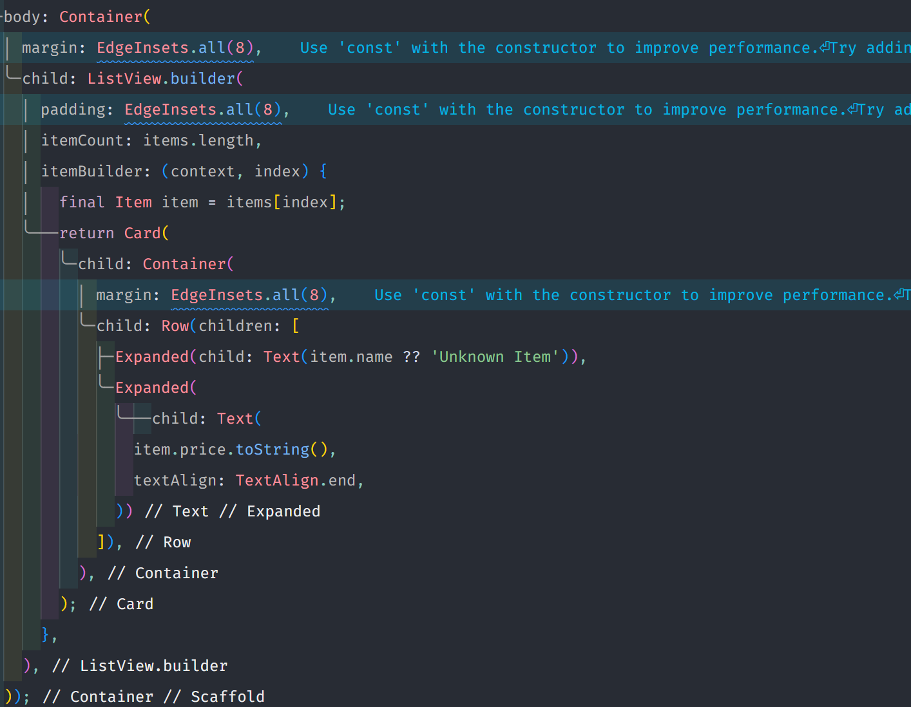

    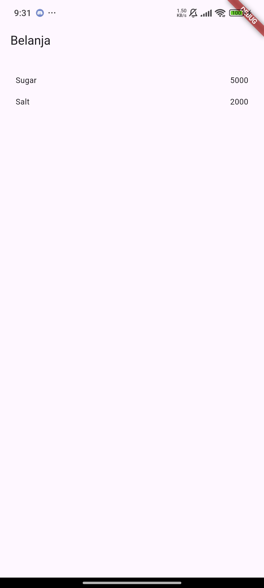

## Tugas Praktikum 2

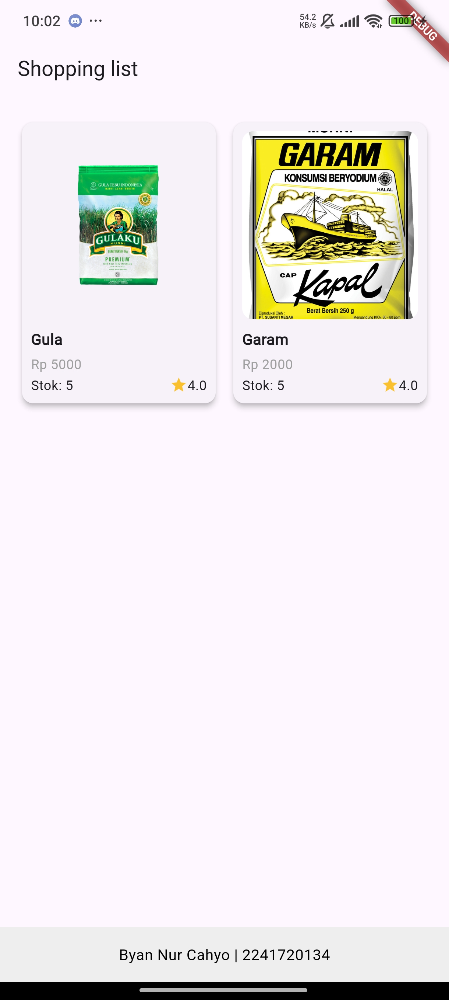

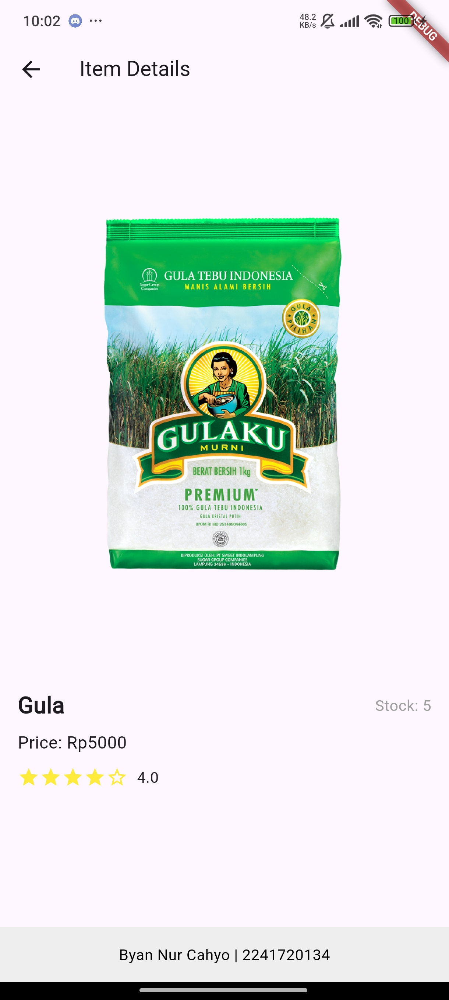
